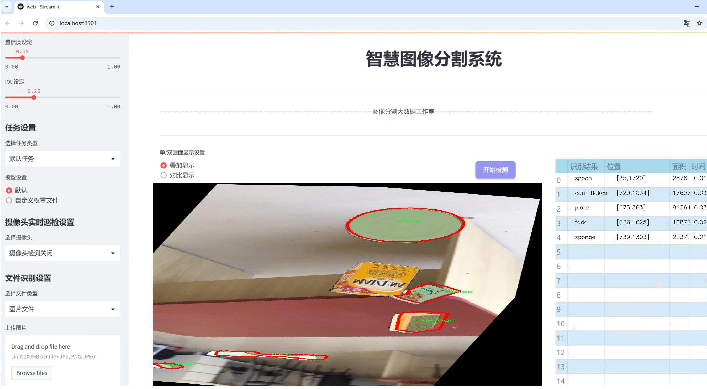
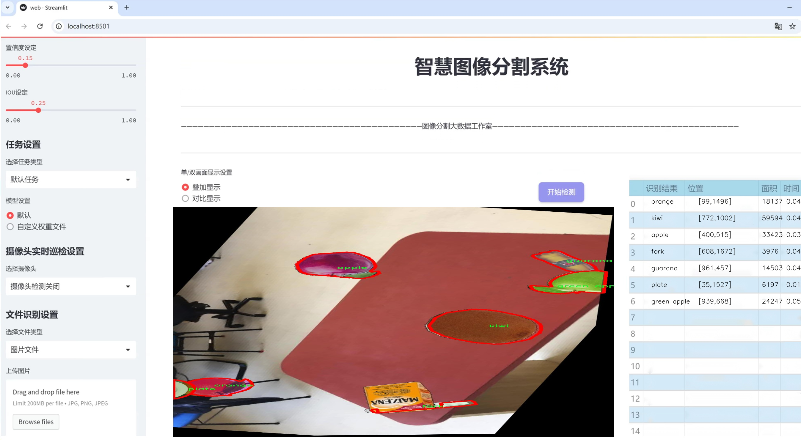
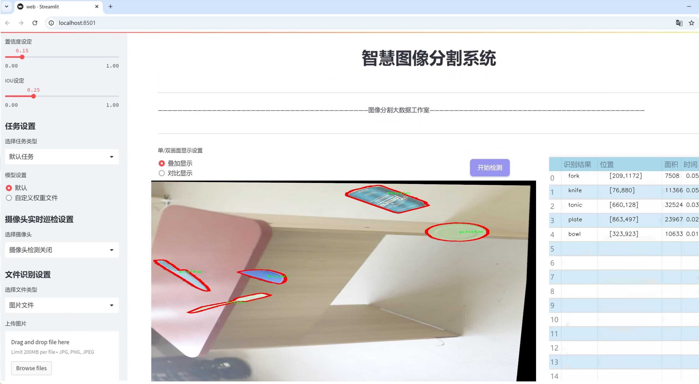
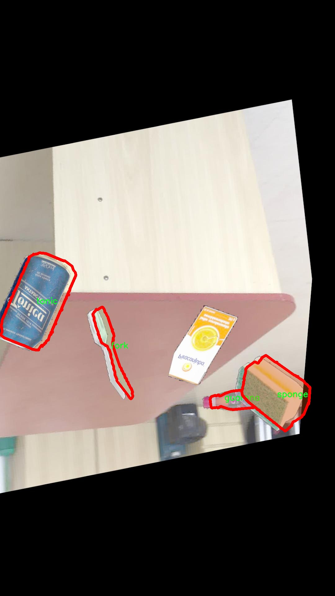
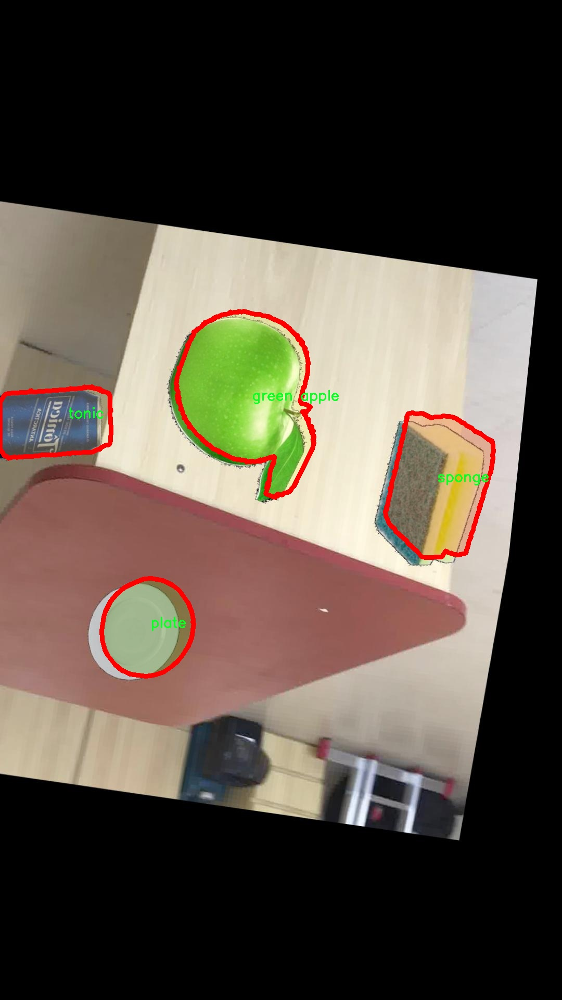
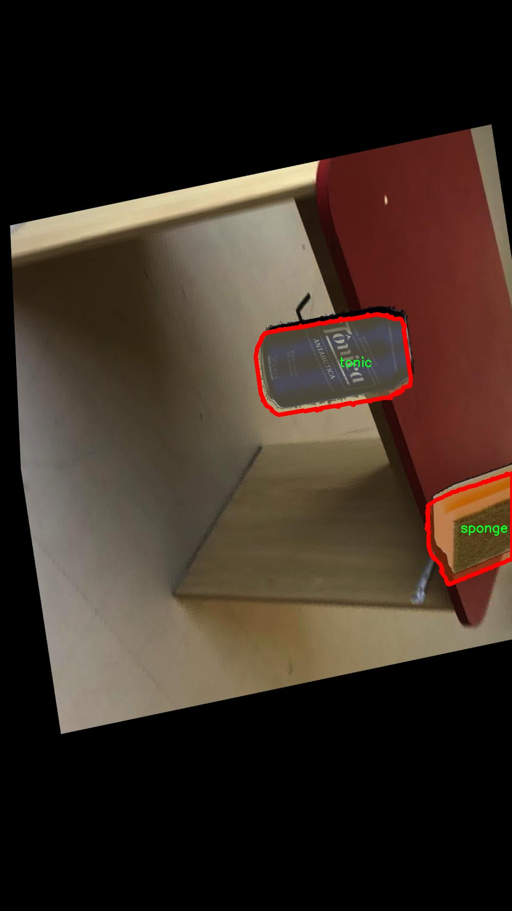
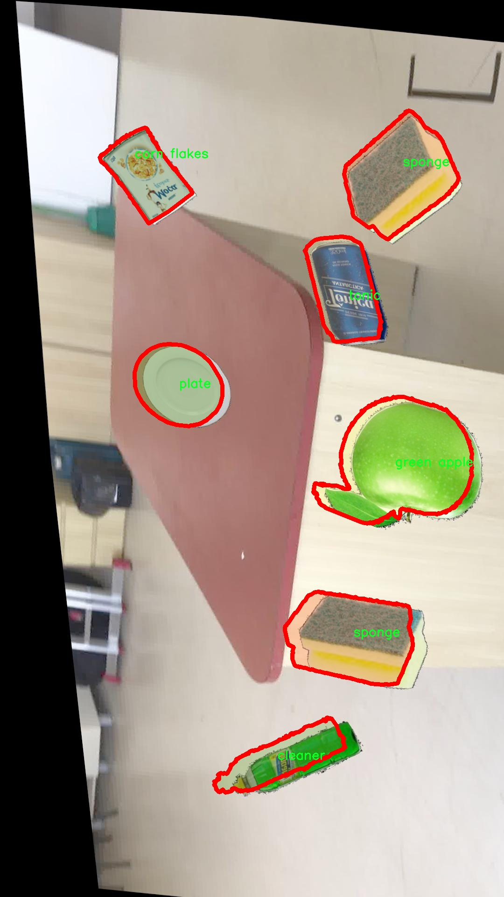
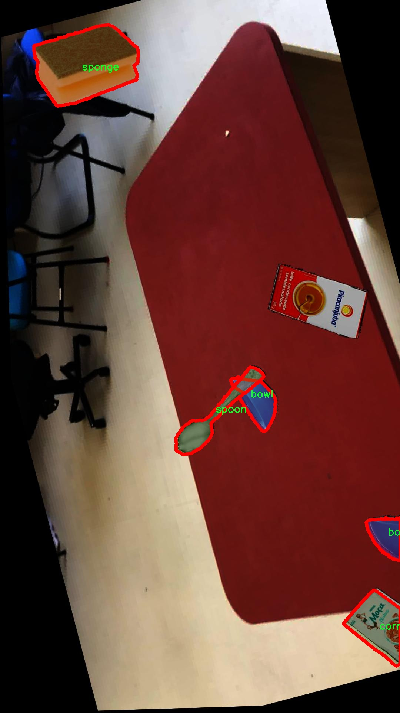

# 厨房用品分割系统源码＆数据集分享
 [yolov8-seg-C2f-DCNV3＆yolov8-seg-AFPN-P345等50+全套改进创新点发刊_一键训练教程_Web前端展示]

### 1.研究背景与意义

项目参考[ILSVRC ImageNet Large Scale Visual Recognition Challenge](https://gitee.com/YOLOv8_YOLOv11_Segmentation_Studio/projects)

项目来源[AAAI Global Al lnnovation Contest](https://kdocs.cn/l/cszuIiCKVNis)

研究背景与意义

随着智能家居和物联网技术的迅速发展，厨房作为家庭生活的重要场所，正逐渐成为智能化的核心区域之一。厨房用品的智能识别与管理不仅可以提升家庭生活的便利性，还能有效地提高厨房的安全性和资源利用效率。在这一背景下，基于计算机视觉的物体分割技术逐渐受到关注，尤其是实例分割（Instance Segmentation）技术的应用，为厨房用品的自动识别和分类提供了新的可能性。

近年来，YOLO（You Only Look Once）系列模型因其优越的实时性和准确性，成为目标检测领域的主流方法。YOLOv8作为该系列的最新版本，结合了深度学习和卷积神经网络的优势，能够在复杂环境中快速而准确地识别多种物体。然而，传统的YOLOv8模型在处理厨房用品的实例分割任务时，仍面临一些挑战，例如物体之间的遮挡、光照变化以及物体形状的多样性等。因此，针对厨房用品的特定需求，对YOLOv8进行改进，构建一个高效的厨房用品分割系统，具有重要的研究意义。

本研究将利用“Objects Lab Instance Segmentation”数据集，该数据集包含1300张图像，涵盖17种厨房用品类别，包括苹果、碗、清洁剂、浓缩牛奶、玉米片、玉米淀粉、叉子、绿苹果、瓜拉那、猕猴桃、刀、橙子、盘子、薯片、海绵、勺子和补品等。这些多样化的物体类别不仅反映了厨房环境的复杂性，也为模型的训练和测试提供了丰富的样本。通过对这些厨房用品进行实例分割，可以实现对厨房环境的全面理解，从而为后续的智能管理提供数据支持。

在实际应用中，改进后的YOLOv8厨房用品分割系统可以广泛应用于智能厨房设备、食品管理、库存监控等多个领域。例如，智能冰箱可以通过该系统实时监测存储的食材，自动生成购物清单，避免食材浪费；智能厨具可以根据识别结果提供个性化的烹饪建议，提高烹饪效率。此外，该系统还可以为家庭用户提供安全警示，识别潜在的危险物品，如刀具和清洁剂，从而保障家庭安全。

综上所述，基于改进YOLOv8的厨房用品分割系统的研究，不仅具有重要的理论价值，还具备广泛的实际应用前景。通过深入探索厨房用品的实例分割技术，我们可以为智能厨房的建设提供有力的技术支持，推动家庭生活的智能化进程。未来，随着技术的不断进步和数据集的不断丰富，基于深度学习的厨房用品识别与管理系统将会在更大范围内发挥其潜力，为人们的生活带来更多便利与安全。

### 2.图片演示







##### 注意：由于此博客编辑较早，上面“2.图片演示”和“3.视频演示”展示的系统图片或者视频可能为老版本，新版本在老版本的基础上升级如下：（实际效果以升级的新版本为准）

  （1）适配了YOLOV8的“目标检测”模型和“实例分割”模型，通过加载相应的权重（.pt）文件即可自适应加载模型。

  （2）支持“图片识别”、“视频识别”、“摄像头实时识别”三种识别模式。

  （3）支持“图片识别”、“视频识别”、“摄像头实时识别”三种识别结果保存导出，解决手动导出（容易卡顿出现爆内存）存在的问题，识别完自动保存结果并导出到tempDir中。

  （4）支持Web前端系统中的标题、背景图等自定义修改，后面提供修改教程。

  另外本项目提供训练的数据集和训练教程,暂不提供权重文件（best.pt）,需要您按照教程进行训练后实现图片演示和Web前端界面演示的效果。

### 3.视频演示

[3.1 视频演示](https://www.bilibili.com/video/BV1fh1CY6Eyr/)

### 4.数据集信息展示

##### 4.1 本项目数据集详细数据（类别数＆类别名）

nc: 15
names: ['apple', 'bowl', 'cleaner', 'corn flakes', 'fork', 'green apple', 'guarana', 'kiwi', 'knife', 'orange', 'plate', 'pringles', 'sponge', 'spoon', 'tonic']


##### 4.2 本项目数据集信息介绍

数据集信息展示

在本研究中，我们采用了名为“Objects Lab Instance Segmentation”的数据集，以支持改进YOLOv8-seg的厨房用品分割系统的训练和评估。该数据集包含15个类别，专注于厨房环境中常见物品的实例分割任务。通过对这些物品的精确识别与分割，我们的目标是提升YOLOv8-seg在复杂背景下的分割性能，从而实现更高效的物品识别与处理。

数据集中包含的类别涵盖了多种厨房用品，具体包括：苹果（apple）、碗（bowl）、清洁剂（cleaner）、玉米片（corn flakes）、叉子（fork）、绿苹果（green apple）、瓜拉那（guarana）、猕猴桃（kiwi）、刀（knife）、橙子（orange）、盘子（plate）、薯片（pringles）、海绵（sponge）、勺子（spoon）和调 tonic。这些类别的选择不仅反映了厨房日常使用的多样性，也为模型的训练提供了丰富的样本，使其能够在实际应用中具备更强的适应性和准确性。

在数据集的构建过程中，采用了高质量的图像采集技术，确保每个物品在不同的光照、角度和背景下均有充分的样本。这种多样性使得模型在面对现实世界中的各种情况时，能够保持较高的鲁棒性。每个类别的图像均经过精细标注，确保每个物品的轮廓和特征得以准确捕捉，这对于实例分割任务尤为重要。

通过使用“Objects Lab Instance Segmentation”数据集，我们能够有效地训练YOLOv8-seg模型，使其在厨房用品的识别与分割任务中表现出色。该数据集不仅提供了丰富的标注信息，还为模型的优化提供了必要的基础。我们期望通过对这些厨房用品的精确分割，提升智能厨房系统的智能化水平，使其能够更好地理解和处理厨房环境中的各种物品。

在训练过程中，我们将数据集划分为训练集和验证集，以确保模型的泛化能力。训练集用于模型的学习，而验证集则用于评估模型在未见数据上的表现。这种划分策略能够有效防止过拟合现象的发生，从而提升模型在实际应用中的可靠性。

此外，针对不同类别的物品，我们还将进行针对性的超参数调整，以优化模型在各个类别上的表现。通过不断迭代和调整，我们期望最终实现一个高效、准确的厨房用品分割系统，能够在实际应用中提供实时的物品识别与处理能力。

总之，“Objects Lab Instance Segmentation”数据集为我们改进YOLOv8-seg的厨房用品分割系统提供了坚实的基础。通过对该数据集的深入分析与利用，我们相信能够推动厨房智能化的发展，为用户提供更为便捷的厨房体验。











### 5.全套项目环境部署视频教程（零基础手把手教学）

[5.1 环境部署教程链接（零基础手把手教学）](https://www.bilibili.com/video/BV1jG4Ve4E9t/?vd_source=bc9aec86d164b67a7004b996143742dc)


[5.2 安装Python虚拟环境创建和依赖库安装视频教程链接（零基础手把手教学）](https://www.bilibili.com/video/BV1nA4VeYEze/?vd_source=bc9aec86d164b67a7004b996143742dc)

### 6.手把手YOLOV8-seg训练视频教程（零基础小白有手就能学会）

[6.1 手把手YOLOV8-seg训练视频教程（零基础小白有手就能学会）](https://www.bilibili.com/video/BV1cA4VeYETe/?vd_source=bc9aec86d164b67a7004b996143742dc)


按照上面的训练视频教程链接加载项目提供的数据集，运行train.py即可开始训练



     Epoch   gpu_mem       box       obj       cls    labels  img_size
     1/200     0G   0.01576   0.01955  0.007536        22      1280: 100%|██████████| 849/849 [14:42<00:00,  1.04s/it]
               Class     Images     Labels          P          R     mAP@.5 mAP@.5:.95: 100%|██████████| 213/213 [01:14<00:00,  2.87it/s]
                 all       3395      17314      0.994      0.957      0.0957      0.0843

     Epoch   gpu_mem       box       obj       cls    labels  img_size
     2/200     0G   0.01578   0.01923  0.007006        22      1280: 100%|██████████| 849/849 [14:44<00:00,  1.04s/it]
               Class     Images     Labels          P          R     mAP@.5 mAP@.5:.95: 100%|██████████| 213/213 [01:12<00:00,  2.95it/s]
                 all       3395      17314      0.996      0.956      0.0957      0.0845

     Epoch   gpu_mem       box       obj       cls    labels  img_size
     3/200     0G   0.01561    0.0191  0.006895        27      1280: 100%|██████████| 849/849 [10:56<00:00,  1.29it/s]
               Class     Images     Labels          P          R     mAP@.5 mAP@.5:.95: 100%|███████   | 187/213 [00:52<00:00,  4.04it/s]
                 all       3395      17314      0.996      0.957      0.0957      0.0845


### 7.50+种全套YOLOV8-seg创新点代码加载调参视频教程（一键加载写好的改进模型的配置文件）

[7.1 50+种全套YOLOV8-seg创新点代码加载调参视频教程（一键加载写好的改进模型的配置文件）](https://www.bilibili.com/video/BV1Hw4VePEXv/?vd_source=bc9aec86d164b67a7004b996143742dc)

### 8.YOLOV8-seg图像分割算法原理

原始YOLOv8-seg算法原理

YOLOv8-seg作为YOLO系列的最新版本，标志着目标检测和实例分割领域的一次重要进步。其核心理念是通过引入创新的网络结构和高效的算法设计，提升模型在多种复杂场景下的表现。YOLOv8-seg不仅延续了YOLO系列的优良传统，还在此基础上进行了诸多改进，以适应更为多样化的应用需求。

首先，YOLOv8-seg的网络结构由三大部分组成：Backbone、Neck和Head。Backbone部分采用了CSPDarknet（Cross Stage Partial Darknet）结构，这一设计的目的是通过分阶段的特征提取来增强模型的表达能力。CSPDarknet将输入特征图分为两个分支，利用多个残差块进行深度学习。这种结构的优势在于，它能够有效地保留特征信息，同时减少计算复杂度。与前代模型YOLOv5相比，YOLOv8-seg引入了C2f模块替代了C3模块，C2f模块通过将特征图分为两个分支并进行降维处理，进而通过堆叠多个分支来生成更高维度的特征图。这种特征图的融合方式不仅提升了模型的梯度流信息，还增强了模型对细节特征的捕捉能力。

在特征提取的过程中，YOLOv8-seg还引入了快速空间金字塔池化（SPPF）结构，这一创新设计旨在提取不同尺度的特征，以适应多样化的目标检测需求。SPPF的引入有效地减少了模型的参数量和计算量，同时提高了特征提取的效率，使得YOLOv8-seg在处理复杂场景时表现得更加出色。

Neck部分采用了特征金字塔网络（FPN）和路径聚合网络（PAN）的结合结构，这一设计使得不同尺度的特征图能够进行有效的融合。通过上采样和下采样的方式，YOLOv8-seg能够在不同层次上对特征进行整合，从而提升模型对目标的感知能力。此结构的灵活性使得YOLOv8-seg能够在处理小目标时表现得尤为突出，解决了传统YOLO模型在小目标检测方面的不足。

在Head部分，YOLOv8-seg采用了无锚框（Anchor-Free）检测方式，这一创新显著提高了检测速度和准确度。传统的锚框方法在复杂背景下容易导致定位误差，而YOLOv8-seg通过直接预测目标的中心点和宽高比例，减少了对锚框的依赖，进而提升了模型的整体性能。此外，YOLOv8-seg还采用了解耦头（Decoupled Head）结构，将分类和回归过程进行解耦，这一设计不仅提高了模型的灵活性，还优化了损失计算过程，使得模型在训练时能够更好地适应不同的任务需求。

为了进一步提升YOLOv8-seg在复杂环境下的表现，研究者们还提出了一些改进措施。例如，在小目标检测方面，增加了一个更小的检测头，以提升网络对小目标的感知能力。同时，Neck端引入了GSConv和Slim-neck技术，这些技术的应用不仅保持了模型的精度，还有效降低了计算量。此外，YOLOv8-seg还采用了MPDIoU损失函数替代传统的CIoU损失函数，这一改进提升了模型的泛化能力和精准度，使得YOLOv8-seg在多种场景下都能保持良好的性能。

总的来说，YOLOv8-seg在设计上充分考虑了目标检测和实例分割的实际需求，通过引入多种创新技术和结构优化，使得模型在精度和速度上都取得了显著的提升。其高效的特征提取和目标检测方式，使得YOLOv8-seg不仅适用于一般的目标检测任务，还能够在复杂的场景中表现出色，展现了YOLO系列模型在计算机视觉领域的强大潜力和广泛应用前景。随着YOLOv8-seg的不断发展和完善，未来在更多实际应用中，其性能和效率将得到进一步的提升，为智能视觉系统的构建提供更为坚实的基础。


### 9.系统功能展示（检测对象为举例，实际内容以本项目数据集为准）

图9.1.系统支持检测结果表格显示

  图9.2.系统支持置信度和IOU阈值手动调节

  图9.3.系统支持自定义加载权重文件best.pt(需要你通过步骤5中训练获得)

  图9.4.系统支持摄像头实时识别

  图9.5.系统支持图片识别

  图9.6.系统支持视频识别

  图9.7.系统支持识别结果文件自动保存

  图9.8.系统支持Excel导出检测结果数据


### 10.50+种全套YOLOV8-seg创新点原理讲解（非科班也可以轻松写刊发刊，V11版本正在科研待更新）

#### 10.1 由于篇幅限制，每个创新点的具体原理讲解就不一一展开，具体见下列网址中的创新点对应子项目的技术原理博客网址【Blog】：


[10.1 50+种全套YOLOV8-seg创新点原理讲解链接](https://gitee.com/qunmasj/good)

#### 10.2 部分改进模块原理讲解(完整的改进原理见上图和技术博客链接)

### Gold-YOLO


#### Preliminaries
YOLO系列的中间层结构采用了传统的FPN结构，其中包含多个分支用于多尺度特征融合。然而，它只充分融合来自相邻级别的特征，对于其他层次的信息只能间接地进行“递归”获取。

传统的FPN结构在信息传输过程中存在丢失大量信息的问题。这是因为层之间的信息交互仅限于中间层选择的信息，未被选择的信息在传输过程中被丢弃。这种情况导致某个Level的信息只能充分辅助相邻层，而对其他全局层的帮助较弱。因此，整体上信息融合的有效性可能受到限制。
为了避免在传输过程中丢失信息，本文采用了一种新颖的“聚集和分发”机制（GD），放弃了原始的递归方法。该机制使用一个统一的模块来收集和融合所有Level的信息，并将其分发到不同的Level。通过这种方式，作者不仅避免了传统FPN结构固有的信息丢失问题，还增强了中间层的部分信息融合能力，而且并没有显著增加延迟。


#### 低阶聚合和分发分支 Low-stage gather-and-distribute branch
从主干网络中选择输出的B2、B3、B4、B5特征进行融合，以获取保留小目标信息的高分辨率特征。


#### 高阶聚合和分发分支 High-stage gather-and-distribute branch
高级全局特征对齐模块（High-GD）将由低级全局特征对齐模块（Low-GD）生成的特征{P3, P4, P5}进行融合。


Transformer融合模块由多个堆叠的transformer组成，transformer块的数量为L。每个transformer块包括一个多头注意力块、一个前馈网络（FFN）和残差连接。采用与LeViT相同的设置来配置多头注意力块，使用16个通道作为键K和查询Q的头维度，32个通道作为值V的头维度。为了加速推理过程，将层归一化操作替换为批归一化，并将所有的GELU激活函数替换为ReLU。为了增强变换器块的局部连接，在两个1x1卷积层之间添加了一个深度卷积层。同时，将FFN的扩展因子设置为2，以在速度和计算成本之间取得平衡。


信息注入模块(Information injection module)： 高级全局特征对齐模块（High-GD）中的信息注入模块与低级全局特征对齐模块（Low-GD）中的相同。在高级阶段，局部特征（Flocal）等于Pi，因此公式如下所示：


#### 增强的跨层信息流动 Enhanced cross-layer information flow
为了进一步提升性能，从YOLOv6 中的PAFPN模块中得到启发，引入了Inject-LAF模块。该模块是注入模块的增强版，包括了一个轻量级相邻层融合（LAF）模块，该模块被添加到注入模块的输入位置。为了在速度和准确性之间取得平衡，设计了两个LAF模型：LAF低级模型和LAF高级模型，分别用于低级注入（合并相邻两层的特征）和高级注入（合并相邻一层的特征）。它们的结构如图5(b)所示。为了确保来自不同层级的特征图与目标大小对齐，在实现中的两个LAF模型仅使用了三个操作符：双线性插值（上采样过小的特征）、平均池化（下采样过大的特征）和1x1卷积（调整与目标通道不同的特征）。模型中的LAF模块与信息注入模块的结合有效地平衡了准确性和速度之间的关系。通过使用简化的操作，能够增加不同层级之间的信息流路径数量，从而提高性能而不显著增加延迟。


### 11.项目核心源码讲解（再也不用担心看不懂代码逻辑）

#### 11.1 ui.py

以下是经过精简和注释的核心代码部分：

```python
import sys
import subprocess
from QtFusion.path import abs_path

def run_script(script_path):
    """
    使用当前 Python 环境运行指定的脚本。

    Args:
        script_path (str): 要运行的脚本路径
    """
    # 获取当前 Python 解释器的路径
    python_path = sys.executable

    # 构建运行命令，使用 streamlit 运行指定的脚本
    command = f'"{python_path}" -m streamlit run "{script_path}"'

    # 执行命令并捕获结果
    result = subprocess.run(command, shell=True)
    
    # 检查命令执行结果，如果返回码不为0，表示出错
    if result.returncode != 0:
        print("脚本运行出错。")

# 主程序入口
if __name__ == "__main__":
    # 获取脚本的绝对路径
    script_path = abs_path("web.py")

    # 运行指定的脚本
    run_script(script_path)
```

### 代码分析与注释：

1. **导入模块**：
   - `sys`：用于访问与 Python 解释器相关的变量和函数。
   - `subprocess`：用于执行外部命令。
   - `abs_path`：从 `QtFusion.path` 模块导入的函数，用于获取文件的绝对路径。

2. **`run_script` 函数**：
   - 该函数接受一个脚本路径作为参数，并使用当前 Python 环境来运行该脚本。
   - 使用 `sys.executable` 获取当前 Python 解释器的路径。
   - 构建一个命令字符串，使用 `streamlit` 来运行指定的脚本。
   - 使用 `subprocess.run` 执行命令，并通过 `shell=True` 允许在 shell 中执行。
   - 检查命令的返回码，如果不为0，则打印错误信息。

3. **主程序入口**：
   - 使用 `if __name__ == "__main__":` 确保该代码块仅在直接运行脚本时执行。
   - 调用 `abs_path` 函数获取 `web.py` 的绝对路径。
   - 调用 `run_script` 函数运行指定的脚本。 

这个代码的核心功能是使用当前 Python 环境来运行一个指定的脚本，并在执行过程中处理可能出现的错误。

这个程序文件名为 `ui.py`，它的主要功能是通过当前的 Python 环境来运行一个指定的脚本，具体是一个名为 `web.py` 的文件。首先，程序导入了几个必要的模块，包括 `sys`、`os` 和 `subprocess`，这些模块分别用于获取系统信息、处理文件路径和执行外部命令。

在文件的开头，定义了一个名为 `run_script` 的函数，该函数接受一个参数 `script_path`，表示要运行的脚本的路径。函数内部首先获取当前 Python 解释器的路径，使用 `sys.executable` 可以得到这个路径。接着，构建一个命令字符串，使用 `streamlit` 来运行指定的脚本。这里的命令格式为 `"{python_path}" -m streamlit run "{script_path}"`，其中 `python_path` 是当前 Python 解释器的路径，`script_path` 是要运行的脚本路径。

随后，使用 `subprocess.run` 方法来执行这个命令。`shell=True` 参数表示在一个新的 shell 中执行命令。执行完命令后，程序检查返回的结果，如果返回码不为 0，说明脚本运行出错，此时会打印出错误信息。

在文件的最后部分，使用 `if __name__ == "__main__":` 来判断当前模块是否是主程序。如果是，则指定要运行的脚本路径为 `web.py`，这个路径是通过 `abs_path` 函数获取的，确保路径是绝对路径。最后，调用 `run_script` 函数来执行指定的脚本。

总体来说，这个文件的功能是封装了一个简单的接口，通过命令行来运行一个 Streamlit 应用，提供了一种便捷的方式来启动一个 Web 应用。

#### 11.2 ultralytics\models\yolo\classify\val.py

以下是代码中最核心的部分，并附上详细的中文注释：

```python
import torch
from ultralytics.data import ClassificationDataset, build_dataloader
from ultralytics.engine.validator import BaseValidator
from ultralytics.utils.metrics import ClassifyMetrics, ConfusionMatrix
from ultralytics.utils.plotting import plot_images

class ClassificationValidator(BaseValidator):
    """
    扩展自 BaseValidator 类的分类验证器，用于基于分类模型的验证。
    """

    def __init__(self, dataloader=None, save_dir=None, pbar=None, args=None, _callbacks=None):
        """初始化 ClassificationValidator 实例，设置数据加载器、保存目录、进度条和参数。"""
        super().__init__(dataloader, save_dir, pbar, args, _callbacks)
        self.targets = None  # 存储真实标签
        self.pred = None     # 存储预测结果
        self.args.task = 'classify'  # 设置任务类型为分类
        self.metrics = ClassifyMetrics()  # 初始化分类指标

    def init_metrics(self, model):
        """初始化混淆矩阵、类名和 top-1、top-5 准确率。"""
        self.names = model.names  # 获取模型的类名
        self.nc = len(model.names)  # 类别数量
        self.confusion_matrix = ConfusionMatrix(nc=self.nc, conf=self.args.conf, task='classify')  # 初始化混淆矩阵
        self.pred = []  # 预测结果列表
        self.targets = []  # 真实标签列表

    def preprocess(self, batch):
        """预处理输入批次并返回处理后的数据。"""
        batch['img'] = batch['img'].to(self.device, non_blocking=True)  # 将图像数据移动到设备上
        batch['img'] = batch['img'].half() if self.args.half else batch['img'].float()  # 根据参数选择数据类型
        batch['cls'] = batch['cls'].to(self.device)  # 将标签数据移动到设备上
        return batch

    def update_metrics(self, preds, batch):
        """使用模型预测和批次目标更新运行指标。"""
        n5 = min(len(self.names), 5)  # 取前5个预测结果
        self.pred.append(preds.argsort(1, descending=True)[:, :n5])  # 按照预测得分排序并取前5
        self.targets.append(batch['cls'])  # 存储真实标签

    def finalize_metrics(self, *args, **kwargs):
        """最终化模型的指标，如混淆矩阵和速度。"""
        self.confusion_matrix.process_cls_preds(self.pred, self.targets)  # 处理预测结果和真实标签
        self.metrics.speed = self.speed  # 记录速度
        self.metrics.confusion_matrix = self.confusion_matrix  # 记录混淆矩阵

    def get_stats(self):
        """返回通过处理目标和预测获得的指标字典。"""
        self.metrics.process(self.targets, self.pred)  # 处理真实标签和预测结果
        return self.metrics.results_dict  # 返回结果字典

    def build_dataset(self, img_path):
        """使用给定的图像路径和预处理参数创建并返回 ClassificationDataset 实例。"""
        return ClassificationDataset(root=img_path, args=self.args, augment=False, prefix=self.args.split)

    def get_dataloader(self, dataset_path, batch_size):
        """构建并返回用于分类任务的数据加载器。"""
        dataset = self.build_dataset(dataset_path)  # 创建数据集
        return build_dataloader(dataset, batch_size, self.args.workers, rank=-1)  # 返回数据加载器

    def print_results(self):
        """打印 YOLO 目标检测模型的评估指标。"""
        pf = '%22s' + '%11.3g' * len(self.metrics.keys)  # 打印格式
        LOGGER.info(pf % ('all', self.metrics.top1, self.metrics.top5))  # 打印 top-1 和 top-5 准确率

    def plot_val_samples(self, batch, ni):
        """绘制验证图像样本。"""
        plot_images(
            images=batch['img'],
            batch_idx=torch.arange(len(batch['img'])),
            cls=batch['cls'].view(-1),  # 使用 .view() 而不是 .squeeze() 以适应分类模型
            fname=self.save_dir / f'val_batch{ni}_labels.jpg',
            names=self.names,
            on_plot=self.on_plot)

    def plot_predictions(self, batch, preds, ni):
        """在输入图像上绘制预测结果并保存结果。"""
        plot_images(batch['img'],
                    batch_idx=torch.arange(len(batch['img'])),
                    cls=torch.argmax(preds, dim=1),  # 获取预测类别
                    fname=self.save_dir / f'val_batch{ni}_pred.jpg',
                    names=self.names,
                    on_plot=self.on_plot)  # 预测结果
```

### 代码核心部分说明：
1. **类的定义**：`ClassificationValidator` 类用于分类模型的验证，继承自 `BaseValidator`。
2. **初始化方法**：`__init__` 方法用于初始化验证器的参数，包括数据加载器、保存目录、进度条等。
3. **指标初始化**：`init_metrics` 方法用于初始化混淆矩阵和相关的分类指标。
4. **数据预处理**：`preprocess` 方法用于将输入数据移动到设备上并进行类型转换。
5. **更新指标**：`update_metrics` 方法用于更新预测结果和真实标签。
6. **最终化指标**：`finalize_metrics` 方法用于处理混淆矩阵和记录速度。
7. **获取统计信息**：`get_stats` 方法用于返回分类结果的统计信息。
8. **数据集和数据加载器构建**：`build_dataset` 和 `get_dataloader` 方法用于创建数据集和数据加载器。
9. **结果打印和绘图**：`print_results`、`plot_val_samples` 和 `plot_predictions` 方法用于打印评估结果和绘制验证样本及预测结果。

这个程序文件是一个用于分类模型验证的类，名为 `ClassificationValidator`，它继承自 `BaseValidator` 类。该类主要用于对分类模型的性能进行评估和验证，特别是针对 YOLO（You Only Look Once）系列模型的分类任务。

在初始化方法 `__init__` 中，类实例化时会接收一些参数，如数据加载器、保存目录、进度条、参数字典等。它还会初始化一些属性，例如目标值和预测值，以及设置任务类型为分类，并创建一个分类指标的实例。

`get_desc` 方法返回一个格式化的字符串，用于总结分类指标，包括类别名称、Top-1 准确率和 Top-5 准确率。

`init_metrics` 方法用于初始化混淆矩阵、类别名称和准确率的计算。它会根据模型的类别名称设置相应的属性，并创建一个混淆矩阵实例。

`preprocess` 方法负责对输入的批次数据进行预处理，包括将图像数据移动到指定设备上（如 GPU），并根据参数决定数据类型（半精度或单精度）。

`update_metrics` 方法用于更新模型的预测结果和目标值，以便后续计算指标。它会将预测结果按降序排序，并提取前五个预测结果。

`finalize_metrics` 方法在所有批次处理完成后，最终化模型的指标，包括处理混淆矩阵和计算速度。如果需要，它还会绘制混淆矩阵的可视化图。

`get_stats` 方法返回一个字典，包含通过处理目标值和预测结果得到的各种指标。

`build_dataset` 方法用于创建并返回一个 `ClassificationDataset` 实例，该实例使用给定的图像路径和预处理参数。

`get_dataloader` 方法则构建并返回一个数据加载器，用于分类任务，接收数据集路径和批次大小作为参数。

`print_results` 方法用于打印 YOLO 模型的评估指标，包括 Top-1 和 Top-5 准确率。

`plot_val_samples` 方法用于绘制验证图像样本，并将结果保存为图像文件。

最后，`plot_predictions` 方法用于在输入图像上绘制预测的边界框，并保存结果图像。

整体来看，这个文件提供了一整套用于分类模型验证的功能，包括数据处理、指标计算、结果打印和可视化等，适用于深度学习模型的评估与分析。

#### 11.3 ultralytics\nn\backbone\convnextv2.py

以下是代码中最核心的部分，并附上详细的中文注释：

```python
import torch
import torch.nn as nn
import torch.nn.functional as F

class LayerNorm(nn.Module):
    """ 自定义的LayerNorm层，支持两种数据格式：channels_last（默认）或channels_first。
    channels_last对应输入形状为(batch_size, height, width, channels)，
    而channels_first对应输入形状为(batch_size, channels, height, width)。
    """
    def __init__(self, normalized_shape, eps=1e-6, data_format="channels_last"):
        super().__init__()
        # 权重和偏置参数
        self.weight = nn.Parameter(torch.ones(normalized_shape))
        self.bias = nn.Parameter(torch.zeros(normalized_shape))
        self.eps = eps
        self.data_format = data_format
        if self.data_format not in ["channels_last", "channels_first"]:
            raise NotImplementedError 
        self.normalized_shape = (normalized_shape, )
    
    def forward(self, x):
        # 根据数据格式选择不同的归一化方式
        if self.data_format == "channels_last":
            return F.layer_norm(x, self.normalized_shape, self.weight, self.bias, self.eps)
        elif self.data_format == "channels_first":
            u = x.mean(1, keepdim=True)  # 计算均值
            s = (x - u).pow(2).mean(1, keepdim=True)  # 计算方差
            x = (x - u) / torch.sqrt(s + self.eps)  # 标准化
            x = self.weight[:, None, None] * x + self.bias[:, None, None]  # 应用权重和偏置
            return x

class Block(nn.Module):
    """ ConvNeXtV2的基本块，包含深度可分离卷积和前馈网络。
    
    Args:
        dim (int): 输入通道数。
        drop_path (float): 随机深度率。默认值: 0.0
    """
    def __init__(self, dim, drop_path=0.):
        super().__init__()
        # 深度可分离卷积
        self.dwconv = nn.Conv2d(dim, dim, kernel_size=7, padding=3, groups=dim)
        self.norm = LayerNorm(dim, eps=1e-6)  # 归一化层
        self.pwconv1 = nn.Linear(dim, 4 * dim)  # 1x1卷积，使用线性层实现
        self.act = nn.GELU()  # 激活函数
        self.pwconv2 = nn.Linear(4 * dim, dim)  # 1x1卷积
        self.drop_path = nn.Identity() if drop_path <= 0. else DropPath(drop_path)  # 随机深度

    def forward(self, x):
        input = x  # 保存输入以便后续残差连接
        x = self.dwconv(x)  # 深度可分离卷积
        x = x.permute(0, 2, 3, 1)  # 调整维度顺序
        x = self.norm(x)  # 归一化
        x = self.pwconv1(x)  # 1x1卷积
        x = self.act(x)  # 激活
        x = self.pwconv2(x)  # 1x1卷积
        x = x.permute(0, 3, 1, 2)  # 恢复维度顺序

        x = input + self.drop_path(x)  # 残差连接
        return x

class ConvNeXtV2(nn.Module):
    """ ConvNeXt V2模型
    
    Args:
        in_chans (int): 输入图像的通道数。默认值: 3
        num_classes (int): 分类头的类别数。默认值: 1000
        depths (tuple(int)): 每个阶段的块数。默认值: [3, 3, 9, 3]
        dims (int): 每个阶段的特征维度。默认值: [96, 192, 384, 768]
        drop_path_rate (float): 随机深度率。默认值: 0.
    """
    def __init__(self, in_chans=3, num_classes=1000, 
                 depths=[3, 3, 9, 3], dims=[96, 192, 384, 768], 
                 drop_path_rate=0.):
        super().__init__()
        self.depths = depths
        self.downsample_layers = nn.ModuleList()  # 下采样层
        # Stem层
        stem = nn.Sequential(
            nn.Conv2d(in_chans, dims[0], kernel_size=4, stride=4),
            LayerNorm(dims[0], eps=1e-6, data_format="channels_first")
        )
        self.downsample_layers.append(stem)
        # 添加下采样层
        for i in range(3):
            downsample_layer = nn.Sequential(
                    LayerNorm(dims[i], eps=1e-6, data_format="channels_first"),
                    nn.Conv2d(dims[i], dims[i+1], kernel_size=2, stride=2),
            )
            self.downsample_layers.append(downsample_layer)

        self.stages = nn.ModuleList()  # 特征分辨率阶段
        dp_rates = [x.item() for x in torch.linspace(0, drop_path_rate, sum(depths))] 
        cur = 0
        # 添加每个阶段的Block
        for i in range(4):
            stage = nn.Sequential(
                *[Block(dim=dims[i], drop_path=dp_rates[cur + j]) for j in range(depths[i])]
            )
            self.stages.append(stage)
            cur += depths[i]

        self.norm = nn.LayerNorm(dims[-1], eps=1e-6)  # 最后的归一化层
        self.head = nn.Linear(dims[-1], num_classes)  # 分类头

    def forward(self, x):
        res = []
        # 逐层下采样和处理
        for i in range(4):
            x = self.downsample_layers[i](x)
            x = self.stages[i](x)
            res.append(x)
        return res
```

### 代码核心部分说明：
1. **LayerNorm**: 自定义的层归一化实现，支持不同的输入格式，主要用于提高模型的稳定性和加速收敛。
2. **Block**: ConvNeXtV2的基本构建块，包含深度可分离卷积、归一化、激活和残差连接，构成了网络的基本单元。
3. **ConvNeXtV2**: 整个模型的定义，包含多个阶段，每个阶段由多个Block组成，最终通过分类头输出结果。

这个程序文件实现了ConvNeXt V2模型的结构，主要用于计算机视觉任务，如图像分类。文件中包含多个类和函数，构成了模型的各个组件。

首先，文件导入了必要的库，包括PyTorch和一些辅助函数。然后定义了一个名为`LayerNorm`的类，它实现了层归一化功能，支持两种数据格式：`channels_last`和`channels_first`。在`forward`方法中，根据输入数据的格式，应用相应的归一化操作。

接下来，定义了`GRN`类，表示全局响应归一化层。该层通过计算输入的L2范数来进行归一化，并使用可学习的参数`gamma`和`beta`来调整输出。

然后是`Block`类，它是ConvNeXt V2的基本构建块。每个块包含一个深度卷积层、层归一化、点卷积层、激活函数（GELU）、GRN层和另一个点卷积层。`drop_path`用于实现随机深度的正则化。`forward`方法定义了数据在块中的前向传播过程。

`ConvNeXtV2`类是整个模型的核心。它接受输入通道数、分类数、每个阶段的块数、特征维度、随机深度率等参数。在初始化时，模型构建了一个下采样层和多个特征阶段，每个阶段由多个残差块组成。最后，定义了一个归一化层和一个线性分类头。模型的权重通过`_init_weights`方法进行初始化。

文件还定义了一个`update_weight`函数，用于更新模型的权重。该函数会检查权重字典中的每个键是否在模型字典中，并且形状是否匹配，然后更新模型的权重。

最后，文件提供了一系列函数（如`convnextv2_atto`、`convnextv2_femto`等），用于创建不同规模的ConvNeXt V2模型。这些函数会根据指定的深度和维度参数构建模型，并在提供权重文件时加载相应的权重。

整体来看，这个文件实现了ConvNeXt V2模型的完整结构，提供了灵活的配置选项，并支持模型权重的加载与更新，适合用于各种图像分类任务。

#### 11.4 train.py

以下是代码中最核心的部分，并附上详细的中文注释：

```python
import os
import torch
import yaml
from ultralytics import YOLO  # 导入YOLO模型库

if __name__ == '__main__':  # 确保该模块被直接运行时才执行以下代码
    # 设置训练参数
    workers = 1  # 数据加载的工作进程数
    batch = 8  # 每个批次的样本数量，视显存情况调整
    device = "0" if torch.cuda.is_available() else "cpu"  # 检查是否有可用的GPU

    # 获取数据集配置文件的绝对路径
    data_path = abs_path(f'datasets/data/data.yaml', path_type='current')

    # 读取YAML文件，保持原有顺序
    with open(data_path, 'r') as file:
        data = yaml.load(file, Loader=yaml.FullLoader)

    # 修改数据集路径为绝对路径
    if 'train' in data and 'val' in data and 'test' in data:
        directory_path = os.path.dirname(data_path)  # 获取目录路径
        data['train'] = os.path.join(directory_path, 'train')  # 更新训练集路径
        data['val'] = os.path.join(directory_path, 'val')  # 更新验证集路径
        data['test'] = os.path.join(directory_path, 'test')  # 更新测试集路径

        # 将修改后的数据写回YAML文件
        with open(data_path, 'w') as file:
            yaml.safe_dump(data, file, sort_keys=False)

    # 加载YOLO模型，使用指定的配置文件和预训练权重
    model = YOLO(r"C:\codeseg\codenew\50+种YOLOv8算法改进源码大全和调试加载训练教程（非必要）\改进YOLOv8模型配置文件\yolov8-seg-C2f-Faster.yaml").load("./weights/yolov8s-seg.pt")

    # 开始训练模型
    results = model.train(
        data=data_path,  # 指定训练数据的配置文件路径
        device=device,  # 指定训练使用的设备
        workers=workers,  # 指定数据加载的工作进程数
        imgsz=640,  # 输入图像的大小为640x640
        epochs=100,  # 训练100个epoch
        batch=batch,  # 每个批次的大小为8
    )
```

### 代码核心部分说明：
1. **参数设置**：定义了数据加载的工作进程数、批次大小和设备（GPU或CPU）。
2. **数据集路径处理**：读取YAML配置文件，更新训练、验证和测试集的路径为绝对路径，并将修改后的内容写回文件。
3. **模型加载**：使用YOLO库加载指定的模型配置和预训练权重。
4. **模型训练**：调用模型的训练方法，传入必要的参数，如数据路径、设备、工作进程数、图像大小和训练轮数。

这个程序文件`train.py`主要用于训练YOLO（You Only Look Once）模型，具体是YOLOv8的一个变种，通常用于目标检测或图像分割任务。程序的结构和功能可以分为几个主要部分。

首先，程序导入了必要的库，包括`os`、`torch`、`yaml`和`ultralytics`中的YOLO模型。`matplotlib`库被导入并设置为使用'TkAgg'后端，以便在需要时进行可视化。

接下来，程序通过`if __name__ == '__main__':`语句确保只有在直接运行该脚本时才会执行后续代码。在这个代码块中，首先设置了一些训练参数，包括工作进程数`workers`、批次大小`batch`和设备`device`。设备的选择基于是否有可用的GPU，如果有则使用GPU（设备编号为"0"），否则使用CPU。

然后，程序通过`abs_path`函数获取数据集配置文件`data.yaml`的绝对路径，并将路径中的分隔符统一为Unix风格。接着，程序提取该路径的目录部分，以便后续修改数据集路径。

程序读取`data.yaml`文件，使用`yaml`库保持原有的顺序，并检查其中是否包含'train'、'val'和'test'三个字段。如果这些字段存在，程序将它们的路径修改为相对于目录的路径，并将修改后的内容写回到`data.yaml`文件中。这一步是为了确保模型训练时能够正确找到训练、验证和测试数据。

在模型加载部分，程序指定了YOLOv8模型的配置文件路径，并加载了预训练的权重文件。用户可以根据自己的需求选择不同的模型配置文件，程序中也给出了几种可供选择的模型。

最后，程序调用`model.train()`方法开始训练模型，传入了数据配置文件路径、设备、工作进程数、输入图像大小、训练轮数和批次大小等参数。这些参数将影响模型的训练过程和性能。

总的来说，这个程序是一个典型的YOLO模型训练脚本，包含了数据准备、模型加载和训练过程的基本步骤，适合用于目标检测或图像分割任务的模型训练。

#### 11.5 ultralytics\nn\backbone\SwinTransformer.py

以下是代码中最核心的部分，并附上详细的中文注释：

```python
import torch
import torch.nn as nn
import torch.nn.functional as F
import numpy as np

class Mlp(nn.Module):
    """ 多层感知机 (MLP) 模块。 """

    def __init__(self, in_features, hidden_features=None, out_features=None, act_layer=nn.GELU, drop=0.):
        super().__init__()
        out_features = out_features or in_features  # 输出特征数，如果未指定则等于输入特征数
        hidden_features = hidden_features or in_features  # 隐藏层特征数，如果未指定则等于输入特征数
        self.fc1 = nn.Linear(in_features, hidden_features)  # 第一层线性变换
        self.act = act_layer()  # 激活函数
        self.fc2 = nn.Linear(hidden_features, out_features)  # 第二层线性变换
        self.drop = nn.Dropout(drop)  # Dropout层

    def forward(self, x):
        """ 前向传播函数。 """
        x = self.fc1(x)  # 线性变换
        x = self.act(x)  # 激活
        x = self.drop(x)  # Dropout
        x = self.fc2(x)  # 线性变换
        x = self.drop(x)  # Dropout
        return x


class WindowAttention(nn.Module):
    """ 基于窗口的多头自注意力 (W-MSA) 模块。 """

    def __init__(self, dim, window_size, num_heads, qkv_bias=True, attn_drop=0., proj_drop=0.):
        super().__init__()
        self.dim = dim  # 输入通道数
        self.window_size = window_size  # 窗口大小
        self.num_heads = num_heads  # 注意力头数
        head_dim = dim // num_heads  # 每个头的维度
        self.scale = head_dim ** -0.5  # 缩放因子

        # 定义相对位置偏置参数表
        self.relative_position_bias_table = nn.Parameter(
            torch.zeros((2 * window_size[0] - 1) * (2 * window_size[1] - 1), num_heads))

        # 计算每个token的相对位置索引
        coords_h = torch.arange(self.window_size[0])
        coords_w = torch.arange(self.window_size[1])
        coords = torch.stack(torch.meshgrid([coords_h, coords_w]))  # 生成坐标网格
        coords_flatten = torch.flatten(coords, 1)  # 展平坐标
        relative_coords = coords_flatten[:, :, None] - coords_flatten[:, None, :]  # 计算相对坐标
        relative_coords = relative_coords.permute(1, 2, 0).contiguous()  # 调整维度
        relative_coords[:, :, 0] += self.window_size[0] - 1  # 位置偏移
        relative_coords[:, :, 1] += self.window_size[1] - 1
        relative_coords[:, :, 0] *= 2 * self.window_size[1] - 1
        relative_position_index = relative_coords.sum(-1)  # 计算相对位置索引
        self.register_buffer("relative_position_index", relative_position_index)  # 注册为缓冲区

        self.qkv = nn.Linear(dim, dim * 3, bias=qkv_bias)  # 计算Q、K、V的线性变换
        self.attn_drop = nn.Dropout(attn_drop)  # 注意力权重的Dropout
        self.proj = nn.Linear(dim, dim)  # 输出的线性变换
        self.proj_drop = nn.Dropout(proj_drop)  # 输出的Dropout
        self.softmax = nn.Softmax(dim=-1)  # Softmax层

    def forward(self, x, mask=None):
        """ 前向传播函数。 """
        B_, N, C = x.shape  # 获取输入的形状
        qkv = self.qkv(x).reshape(B_, N, 3, self.num_heads, C // self.num_heads).permute(2, 0, 3, 1, 4)  # 计算Q、K、V
        q, k, v = qkv[0], qkv[1], qkv[2]  # 分离Q、K、V

        q = q * self.scale  # 缩放Q
        attn = (q @ k.transpose(-2, -1))  # 计算注意力权重

        # 添加相对位置偏置
        relative_position_bias = self.relative_position_bias_table[self.relative_position_index.view(-1)].view(
            self.window_size[0] * self.window_size[1], self.window_size[0] * self.window_size[1], -1)
        relative_position_bias = relative_position_bias.permute(2, 0, 1).contiguous()  # 调整维度
        attn = attn + relative_position_bias.unsqueeze(0)  # 加入相对位置偏置

        if mask is not None:
            attn = attn + mask.unsqueeze(1).unsqueeze(0)  # 加入mask
        attn = self.softmax(attn)  # Softmax归一化
        attn = self.attn_drop(attn)  # Dropout

        x = (attn @ v).transpose(1, 2).reshape(B_, N, C)  # 计算输出
        x = self.proj(x)  # 线性变换
        x = self.proj_drop(x)  # Dropout
        return x


class SwinTransformer(nn.Module):
    """ Swin Transformer 主体。 """

    def __init__(self, depths, num_heads, embed_dim=96, window_size=7):
        super().__init__()
        self.embed_dim = embed_dim  # 嵌入维度
        self.layers = nn.ModuleList()  # 存储各层

        # 构建各层
        for i_layer in range(len(depths)):
            layer = BasicLayer(
                dim=int(embed_dim * 2 ** i_layer),
                depth=depths[i_layer],
                num_heads=num_heads[i_layer],
                window_size=window_size)
            self.layers.append(layer)

    def forward(self, x):
        """ 前向传播函数。 """
        for layer in self.layers:
            x = layer(x)  # 逐层前向传播
        return x  # 返回最终输出
```

### 代码核心部分说明：
1. **Mlp类**：实现了一个多层感知机，包括两个线性层和激活函数，支持Dropout。
2. **WindowAttention类**：实现了窗口基础的多头自注意力机制，支持相对位置偏置，计算Q、K、V并进行注意力计算。
3. **SwinTransformer类**：实现了Swin Transformer的主体结构，包含多个基本层（BasicLayer），每层由多个模块组成，负责特征提取和变换。

这些部分是Swin Transformer的核心组成部分，负责模型的主要功能和特征处理。

这个程序文件实现了Swin Transformer模型的结构，Swin Transformer是一种基于视觉的Transformer架构，主要用于图像处理任务。文件中定义了多个类和函数，以构建和训练Swin Transformer模型。

首先，程序导入了必要的库，包括PyTorch和一些用于模型构建的工具。接着，定义了一个名为`Mlp`的类，这是一个多层感知机（MLP），包含两个线性层和一个激活函数（默认为GELU），并在每个线性层后应用了Dropout以防止过拟合。

接下来，定义了两个函数`window_partition`和`window_reverse`，用于将输入特征分割成窗口和将窗口合并回原始特征。这种窗口机制是Swin Transformer的核心思想之一，它通过局部窗口内的自注意力机制来减少计算复杂度。

然后，定义了`WindowAttention`类，这是窗口基础的多头自注意力模块。该模块支持相对位置偏置，并能够处理移动窗口（shifted window）和非移动窗口的情况。它的前向传播方法计算查询、键和值，并应用注意力机制，最后将结果通过线性层进行投影。

接着，`SwinTransformerBlock`类被定义，它包含了一个窗口注意力层和一个前馈网络（MLP）。在前向传播中，输入特征经过归一化、窗口分割、注意力计算、窗口合并和残差连接等步骤。

`PatchMerging`类用于将输入特征图的多个小块合并为更大的块，以减少特征图的尺寸并增加通道数。它在前向传播中处理输入特征并进行线性变换。

`BasicLayer`类代表Swin Transformer的一个基本层，包含多个Swin Transformer块，并在必要时进行下采样。它还计算了注意力掩码，以支持移动窗口的自注意力机制。

`PatchEmbed`类负责将输入图像分割成小块并进行嵌入。它使用卷积层将图像的每个小块映射到高维空间。

最后，`SwinTransformer`类是整个模型的主类，负责将所有组件组合在一起。它接受图像输入，经过嵌入、位置编码、多个基本层的处理后，输出特征图。模型的构造函数中定义了各个层的参数，包括深度、头数、窗口大小等。

文件的最后部分定义了一个`update_weight`函数，用于更新模型的权重，并提供了一个`SwinTransformer_Tiny`函数，用于创建一个小型的Swin Transformer模型实例并加载预训练权重（如果提供）。

总体来说，这个文件实现了Swin Transformer的完整结构，包含了多种模块和功能，适用于图像处理任务。

#### 11.6 ultralytics\hub\utils.py

以下是经过简化和注释的核心代码部分：

```python
import os
import platform
import random
import sys
import threading
import time
from pathlib import Path
import requests
from ultralytics.utils import (ENVIRONMENT, LOGGER, ONLINE, RANK, SETTINGS, TESTS_RUNNING, TQDM, TryExcept, __version__,
                               colorstr, get_git_origin_url, is_colab, is_git_dir, is_pip_package)
from ultralytics.utils.downloads import GITHUB_ASSETS_NAMES

# 定义一些常量
PREFIX = colorstr('Ultralytics HUB: ')
HUB_API_ROOT = os.environ.get('ULTRALYTICS_HUB_API', 'https://api.ultralytics.com')

def requests_with_progress(method, url, **kwargs):
    """
    使用指定的方法和URL进行HTTP请求，并可选地显示进度条。

    参数:
        method (str): HTTP方法（例如 'GET', 'POST'）。
        url (str): 请求的URL。
        **kwargs (dict): 传递给requests.request函数的其他关键字参数。

    返回:
        (requests.Response): HTTP请求的响应对象。
    """
    progress = kwargs.pop('progress', False)  # 从kwargs中提取进度参数
    if not progress:
        return requests.request(method, url, **kwargs)  # 如果没有进度，直接请求

    # 如果需要显示进度条
    response = requests.request(method, url, stream=True, **kwargs)
    total = int(response.headers.get('content-length', 0))  # 获取内容总大小
    pbar = TQDM(total=total, unit='B', unit_scale=True, unit_divisor=1024)  # 初始化进度条
    for data in response.iter_content(chunk_size=1024):  # 分块读取响应内容
        pbar.update(len(data))  # 更新进度条
    pbar.close()  # 关闭进度条
    return response  # 返回响应对象

def smart_request(method, url, retry=3, timeout=30, thread=True, verbose=True, progress=False, **kwargs):
    """
    使用'requests'库进行HTTP请求，支持重试和超时。

    参数:
        method (str): 请求的方法（'post'或'get'）。
        url (str): 请求的URL。
        retry (int): 重试次数，默认为3。
        timeout (int): 超时时间，默认为30秒。
        thread (bool): 是否在单独的线程中执行请求，默认为True。
        verbose (bool): 是否打印日志，默认为True。
        progress (bool): 是否显示进度条，默认为False。
        **kwargs (dict): 传递给requests函数的其他关键字参数。

    返回:
        (requests.Response): HTTP响应对象。
    """
    retry_codes = (408, 500)  # 需要重试的状态码

    @TryExcept(verbose=verbose)
    def func(func_method, func_url, **func_kwargs):
        """执行HTTP请求，支持重试和超时。"""
        r = None  # 初始化响应
        t0 = time.time()  # 记录开始时间
        for i in range(retry + 1):
            if (time.time() - t0) > timeout:  # 超过超时时间，停止重试
                break
            r = requests_with_progress(func_method, func_url, **func_kwargs)  # 发起请求
            if r.status_code < 300:  # 如果响应状态码为2xx，表示成功
                break
            # 处理错误信息
            if i == 0 and r.status_code in retry_codes:
                LOGGER.warning(f'{PREFIX}请求失败，正在重试... {r.status_code}')
            time.sleep(2 ** i)  # 指数退避策略
        return r  # 返回响应

    args = method, url
    kwargs['progress'] = progress  # 将进度参数传递给内部函数
    if thread:
        threading.Thread(target=func, args=args, kwargs=kwargs, daemon=True).start()  # 在新线程中执行
    else:
        return func(*args, **kwargs)  # 在当前线程中执行

class Events:
    """
    用于收集匿名事件分析的类。事件分析在设置中sync=True时启用。
    """
    url = 'https://www.google-analytics.com/mp/collect?measurement_id=G-X8NCJYTQXM&api_secret=QLQrATrNSwGRFRLE-cbHJw'

    def __init__(self):
        """初始化事件对象，设置默认值。"""
        self.events = []  # 事件列表
        self.rate_limit = 60.0  # 速率限制（秒）
        self.t = 0.0  # 速率限制计时器
        self.metadata = {
            'cli': Path(sys.argv[0]).name == 'yolo',
            'install': 'git' if is_git_dir() else 'pip' if is_pip_package() else 'other',
            'python': '.'.join(platform.python_version_tuple()[:2]),  # Python版本
            'version': __version__,
            'env': ENVIRONMENT,
            'session_id': round(random.random() * 1E15),  # 随机会话ID
            'engagement_time_msec': 1000
        }
        self.enabled = SETTINGS['sync'] and RANK in (-1, 0) and not TESTS_RUNNING and ONLINE

    def __call__(self, cfg):
        """
        尝试将新事件添加到事件列表，并在达到速率限制时发送事件。

        参数:
            cfg (IterableSimpleNamespace): 包含模式和任务信息的配置对象。
        """
        if not self.enabled:
            return  # 如果事件分析未启用，直接返回

        # 添加事件到列表
        if len(self.events) < 25:  # 限制事件列表最多25个事件
            params = {**self.metadata, 'task': cfg.task, 'model': cfg.model}
            self.events.append({'name': cfg.mode, 'params': params})

        # 检查速率限制
        t = time.time()
        if (t - self.t) < self.rate_limit:
            return  # 如果未达到速率限制，直接返回

        # 达到速率限制，发送事件
        data = {'client_id': SETTINGS['uuid'], 'events': self.events}  # 发送数据
        smart_request('post', self.url, json=data, retry=0, verbose=False)  # 发送POST请求

        # 重置事件列表和计时器
        self.events = []
        self.t = t

# 初始化事件对象
events = Events()
```

### 代码注释说明：
1. **常量定义**：定义了一些常量，包括API根URL和Web根URL。
2. **请求函数**：`requests_with_progress` 函数用于发起HTTP请求，并在下载时显示进度条。
3. **智能请求函数**：`smart_request` 函数支持重试机制和超时设置，确保请求的可靠性。
4. **事件类**：`Events` 类用于收集和发送匿名事件分析数据，包含事件的元数据和速率限制逻辑。
5. **事件发送逻辑**：在事件列表达到一定数量或时间间隔后，自动发送事件数据到指定的URL。

这个程序文件是Ultralytics YOLO项目中的一个工具模块，主要用于处理与Ultralytics Hub相关的请求和事件分析。文件的开头部分导入了一些必要的库和模块，包括操作系统、平台、随机数、线程、时间、路径处理、HTTP请求等。它还从`ultralytics.utils`模块中导入了一些工具函数和常量，例如日志记录器、环境信息、版本号等。

文件中定义了几个主要的函数和一个类。首先，`request_with_credentials`函数用于在Google Colab环境中发起带有凭证的AJAX请求。该函数检查当前环境是否为Colab，如果不是，则抛出一个错误。它使用JavaScript在Colab中执行请求，并返回响应数据。

接下来，`requests_with_progress`函数用于发起HTTP请求，并在下载过程中显示进度条。它接受HTTP方法和URL作为参数，并可以选择性地显示进度条。函数通过`requests`库发起请求，并在响应的内容长度已知的情况下更新进度条。

`smart_request`函数则是一个更复杂的请求处理函数，支持重试机制和超时设置。它使用指数退避算法在请求失败时进行重试，支持在单独的线程中执行请求。该函数还可以显示进度条，并记录请求的状态。

最后，`Events`类用于收集匿名事件分析数据。它在初始化时设置了一些默认值，包括事件列表、速率限制、元数据等。类的`__call__`方法尝试将新事件添加到事件列表中，并在达到速率限制时发送事件数据。该类会根据一些条件决定是否启用事件收集功能，例如是否在线、是否在测试运行中等。

文件的最后部分创建了一个`Events`类的实例，以便在后续代码中使用。整体来看，这个模块为Ultralytics Hub提供了网络请求的便利性和事件分析的能力，帮助开发者更好地管理和监控其应用程序的运行状态。

### 12.系统整体结构（节选）

### 整体功能和构架概括

该项目是一个基于Ultralytics的YOLO（You Only Look Once）系列模型的实现，主要用于目标检测和图像分类任务。项目的整体架构由多个模块组成，每个模块负责特定的功能，包括模型的定义、训练、验证、工具函数、数据处理等。以下是各个模块的功能概述：

- **模型定义**：实现了多种深度学习模型（如ConvNeXt、Swin Transformer等），为目标检测和图像分类提供了基础架构。
- **训练与验证**：提供了训练和验证模型的功能，支持数据加载、模型评估和性能指标计算。
- **工具函数**：包括数据处理、请求处理、事件分析等辅助功能，简化了模型的使用和集成。
- **用户界面**：提供了简单的用户界面功能，便于用户通过命令行启动和运行模型。

### 文件功能整理表

| 文件路径                                      | 功能描述                                                   |
|-------------------------------------------|--------------------------------------------------------|
| `ui.py`                                   | 提供命令行接口，运行指定的Streamlit应用（如web.py）。        |
| `ultralytics/models/yolo/classify/val.py` | 实现分类模型的验证功能，包括指标计算和可视化。               |
| `ultralytics/nn/backbone/convnextv2.py`  | 定义ConvNeXt V2模型的结构和组件，支持图像分类任务。          |
| `train.py`                                | 负责训练YOLO模型，处理数据集配置和模型训练参数。             |
| `ultralytics/nn/backbone/SwinTransformer.py` | 实现Swin Transformer模型的结构，适用于图像处理任务。         |
| `ultralytics/hub/utils.py`               | 提供与Ultralytics Hub相关的请求处理和事件分析功能。          |
| `ultralytics/engine/validator.py`        | 实现模型验证的核心逻辑，包括性能评估和结果输出。              |
| `ultralytics/utils/autobatch.py`         | 实现自动批处理功能，优化数据加载和模型推理效率。              |
| `ultralytics/nn/backbone/fasternet.py`   | 定义FastNet模型的结构，适用于快速目标检测任务。               |
| `ultralytics/utils/torch_utils.py`       | 提供与PyTorch相关的工具函数，简化模型训练和推理过程。         |
| `ultralytics/trackers/basetrack.py`      | 实现基本的目标跟踪功能，支持视频流中的目标检测和跟踪。         |
| `ultralytics/utils/checks.py`            | 提供模型和数据的检查功能，确保训练和推理过程中的数据有效性。   |
| `ultralytics/nn/extra_modules/dynamic_snake_conv.py` | 实现动态蛇形卷积模块，增强模型的特征提取能力。               |

这个表格总结了项目中各个文件的主要功能，帮助理解项目的整体架构和各个模块之间的关系。

注意：由于此博客编辑较早，上面“11.项目核心源码讲解（再也不用担心看不懂代码逻辑）”中部分代码可能会优化升级，仅供参考学习，完整“训练源码”、“Web前端界面”和“50+种创新点源码”以“14.完整训练+Web前端界面+50+种创新点源码、数据集获取”的内容为准。

### 13.图片、视频、摄像头图像分割Demo(去除WebUI)代码

在这个博客小节中，我们将讨论如何在不使用WebUI的情况下，实现图像分割模型的使用。本项目代码已经优化整合，方便用户将分割功能嵌入自己的项目中。
核心功能包括图片、视频、摄像头图像的分割，ROI区域的轮廓提取、类别分类、周长计算、面积计算、圆度计算以及颜色提取等。
这些功能提供了良好的二次开发基础。

### 核心代码解读

以下是主要代码片段，我们会为每一块代码进行详细的批注解释：

```python
import random
import cv2
import numpy as np
from PIL import ImageFont, ImageDraw, Image
from hashlib import md5
from model import Web_Detector
from chinese_name_list import Label_list

# 根据名称生成颜色
def generate_color_based_on_name(name):
    ......

# 计算多边形面积
def calculate_polygon_area(points):
    return cv2.contourArea(points.astype(np.float32))

...
# 绘制中文标签
def draw_with_chinese(image, text, position, font_size=20, color=(255, 0, 0)):
    image_pil = Image.fromarray(cv2.cvtColor(image, cv2.COLOR_BGR2RGB))
    draw = ImageDraw.Draw(image_pil)
    font = ImageFont.truetype("simsun.ttc", font_size, encoding="unic")
    draw.text(position, text, font=font, fill=color)
    return cv2.cvtColor(np.array(image_pil), cv2.COLOR_RGB2BGR)

# 动态调整参数
def adjust_parameter(image_size, base_size=1000):
    max_size = max(image_size)
    return max_size / base_size

# 绘制检测结果
def draw_detections(image, info, alpha=0.2):
    name, bbox, conf, cls_id, mask = info['class_name'], info['bbox'], info['score'], info['class_id'], info['mask']
    adjust_param = adjust_parameter(image.shape[:2])
    spacing = int(20 * adjust_param)

    if mask is None:
        x1, y1, x2, y2 = bbox
        aim_frame_area = (x2 - x1) * (y2 - y1)
        cv2.rectangle(image, (x1, y1), (x2, y2), color=(0, 0, 255), thickness=int(3 * adjust_param))
        image = draw_with_chinese(image, name, (x1, y1 - int(30 * adjust_param)), font_size=int(35 * adjust_param))
        y_offset = int(50 * adjust_param)  # 类别名称上方绘制，其下方留出空间
    else:
        mask_points = np.concatenate(mask)
        aim_frame_area = calculate_polygon_area(mask_points)
        mask_color = generate_color_based_on_name(name)
        try:
            overlay = image.copy()
            cv2.fillPoly(overlay, [mask_points.astype(np.int32)], mask_color)
            image = cv2.addWeighted(overlay, 0.3, image, 0.7, 0)
            cv2.drawContours(image, [mask_points.astype(np.int32)], -1, (0, 0, 255), thickness=int(8 * adjust_param))

            # 计算面积、周长、圆度
            area = cv2.contourArea(mask_points.astype(np.int32))
            perimeter = cv2.arcLength(mask_points.astype(np.int32), True)
            ......

            # 计算色彩
            mask = np.zeros(image.shape[:2], dtype=np.uint8)
            cv2.drawContours(mask, [mask_points.astype(np.int32)], -1, 255, -1)
            color_points = cv2.findNonZero(mask)
            ......

            # 绘制类别名称
            x, y = np.min(mask_points, axis=0).astype(int)
            image = draw_with_chinese(image, name, (x, y - int(30 * adjust_param)), font_size=int(35 * adjust_param))
            y_offset = int(50 * adjust_param)

            # 绘制面积、周长、圆度和色彩值
            metrics = [("Area", area), ("Perimeter", perimeter), ("Circularity", circularity), ("Color", color_str)]
            for idx, (metric_name, metric_value) in enumerate(metrics):
                ......

    return image, aim_frame_area

# 处理每帧图像
def process_frame(model, image):
    pre_img = model.preprocess(image)
    pred = model.predict(pre_img)
    det = pred[0] if det is not None and len(det)
    if det:
        det_info = model.postprocess(pred)
        for info in det_info:
            image, _ = draw_detections(image, info)
    return image

if __name__ == "__main__":
    cls_name = Label_list
    model = Web_Detector()
    model.load_model("./weights/yolov8s-seg.pt")

    # 摄像头实时处理
    cap = cv2.VideoCapture(0)
    while cap.isOpened():
        ret, frame = cap.read()
        if not ret:
            break
        ......

    # 图片处理
    image_path = './icon/OIP.jpg'
    image = cv2.imread(image_path)
    if image is not None:
        processed_image = process_frame(model, image)
        ......

    # 视频处理
    video_path = ''  # 输入视频的路径
    cap = cv2.VideoCapture(video_path)
    while cap.isOpened():
        ret, frame = cap.read()
        ......
```


### 14.完整训练+Web前端界面+50+种创新点源码、数据集获取


# [下载链接：https://mbd.pub/o/bread/ZpyWmJ9v](https://mbd.pub/o/bread/ZpyWmJ9v)